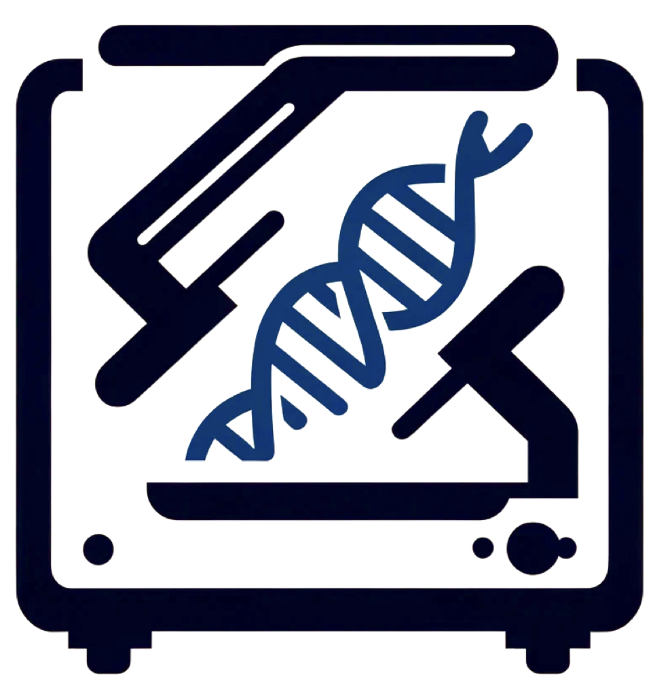

# SCANNER (Single cell Allelic copy Number scanNER)
[](https://badge.fury.io/py/copy-scanner)
[](https://opensource.org/licenses/MIT)

Scanner is a python package for high-resolution single-cell allele-specific copy number analysis. It provides a complete workflow for single cell allelic copy number analysis, including preprocessing, segmentation, copy number inference, and visualization.

## Installation

It is recommended to install scanner in a virtual environment. Here's how to create one using conda:
```bash
conda create -n scanner_env python=3.8
```
To install scanner, simply use pip:
```bash
pip install copy-scanner
```

## Quick Start
Here's a quick overview of how to run scanner.
```python
import scanner
# define your json file path
path = "your/dir/to/json"
# preprocess
scanner.pp.preprocess(path)
# segment
scanner.tl.segment(path)
# infer copy number
scanner.tl.infer_copy_number(path)
# visualize 
scanner.pl.plot_whole_genome_track(path)
```

## Input data


## Operating System
Scanner was tested in the following operating systems:
- macOS Ventura 13.5.2
- CentOS Linux 7.9
- Windows 11
## Documentation
For more detailed information and advanced usage, please refer to our [documentation](docs/).

## Contributing
Contributions to scanner are welcome. Please refer to our [contribution guidelines](docs/contribution_guidelines.md) for more information.

## Support
For support or questions, please open an issue on our [GitHub repository](github.com/parklab/scanner).


## LICENSE
Scanner is released under the [MIT License](LICENSE), and is freely available for non-commercial use.

